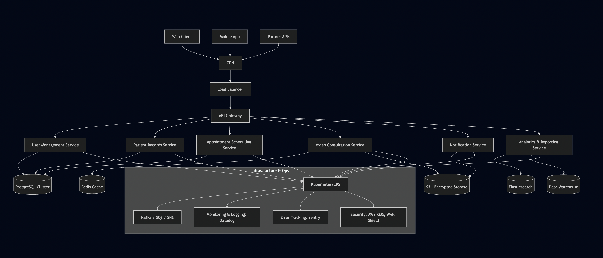

# Telehealth Platform System Design

## Overview

This document outlines the high-level architecture for a telehealth platform designed to support 100,000+ concurrent users while maintaining HIPAA compliance and enterprise-grade security.

## System Requirements

- **Video consultations** with real-time communication
- **Patient record management** with secure data storage
- **Secure authentication** with multi-factor authentication
- **Scalability** to handle 100,000+ concurrent users
- **HIPAA compliance** for healthcare data protection

## Assumptions

- Peak concurrent users: 100K (likely means 500K+ total registered users)
- HIPAA compliance is non-negotiable for patient data
- Multi-region deployment for latency optimization
- Video calls requires high bandwidth and real-time processing
- Read-heavy for medical records, write-heavy during consultations
- 99.9% uptime requirement (healthcare is critical)

## Architecture Diagram

## Technology Stack

### Frontend
- **React 18** with TypeScript (type safety)
- **React Native** for cross-platform mobile applications
- **Tailwind CSS** for utility-first styling

### Backend & API Layer
- **Node.js with NestJS** - Enterprise-grade framework with built-in dependency injection, decorators, and modular architecture
- **AWS API Gateway** - Managed service for request routing, rate limiting, and API versioning

### Data Layer
- **PostgreSQL (AWS RDS)** - ACID-compliant relational database
- **Redis** - In-memory caching for session management and frequently accessed data
- **AWS S3** - Secure, scalable object storage for medical documents and files with encryption at rest
- **Elasticsearch** - (patient/doctor search functionality)

### Infrastructure & Security
- **AWS Cloud Platform** - Comprehensive cloud services with healthcare compliance certifications
- **AWS WAF + Shield** - Web application firewall and DDoS protection
- **AWS KMS** - Centralized encryption key management for data protection

## Scalability Considerations

**For scaling**
- Kubernetes auto-scaling based on CPU/memory metrics
- Load balancing across multiple service instances
- PostgreSQL read replicas for read-heavy operations (patient records, search)
- Redis clustering for cache distribution

**Specifically for handling concurrent users**

- Auto-scaling groups with predictive scaling
- Database query optimization and indexing
- Efficient WebRTC implementation for video calls

## Security Architecture

**Authentication & Authorization**
- Short live JWT tokens
- MFA authentication (could create our own or much better leverage off the shelve products)
- RBA Control
- OAuth 2.0

**Data Protection**
- Encryption at rest and in transit
- Key management
- Audit trails of PHI access

**Compliance**
- Data Retention in logs in DD
- Regular Backup data

## Monitoring & Observability

**Application Monitoring**
- Datadog
-- We can create custom alerts and monitoring here
- Sentry
- Cloudwatch for SQS or MSK (kafka)

## Microservices Architecture

I chose a microservices approach over a monolithic architecture for several key reasons:

- Each service can be scaled based on demand (e.g., notification service during peak hours)
- Can use different technologies for different services if needed
- Issues in one service don't bring down the entire system
- Different teams can own and deploy services independently
- Easier to implement different security levels for different data types

We accepted the increasd operational complexity for better scalability and make it easier for the team.
It also makes it easier for complience since services have their own boundaries.

breakdown of service I'd make:

- **Authentication Service** - User authentication and authorization
- **Patient Service** - Patient profile management
- **Appointment Service**  - Scheduling and calendar management
- **Notification Service** - Multi-channel notifications (email, SMS, push)